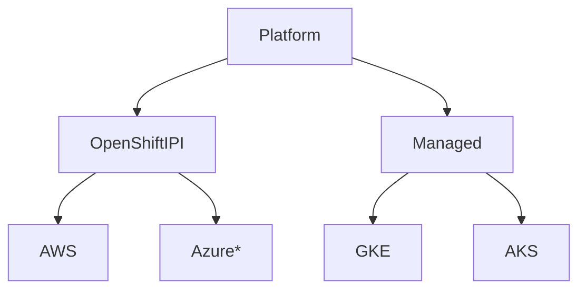

# scaffolding
Ansible Automation to bring up a Performance SUT

# Quickstart

## GKE

Pull the container image with all the necessary tools -- sorry about the size, happy to have someone reduce it

`$ podman pull quay.io/jtaleric/scaffolding`

Kick it

`$ podman run -ti --name scaffold --hostname scaffolding --network host quay.io/jtaleric/scaffolding:latest /bin/bash`

You will need to retrieve a `Service Account`. To get this:
- Login to the GCloud Console
- Click the Project which you want to build clusters in.
- In the Menu choose "IAM & Admin" -> Service Account
- Click Create Service Account
- Once created, click the newly created Service Account
- On the top bar, click Keys
- Click Add Key and download the JSON

Store this file within this directory. Whatever you name it, update `group_vars/all` with the value.

```yaml
gke:
  region: "us-west2-a"
  project: "cilium-perf"
  auth_kind: "serviceaccount"
  sa_file: "my_sa.json"
  machine_type: "n1-standard-4"
  image_type: ubuntu_containerd
```
You will also need to update the `project` key here too to match you specific project.

If you want to swap kernels, you need to use the `ubuntu_containerd` image type.

We will assume the user is storing results in Elasticsearch, so update `es_url` with your ES Server information.

Once all the necessary changes are made, and the Service Account JSON is dropped in, kick a full pipeline run

`$ ansible-playbook platform-install-kernel-benchmark.yml --tags gke,prometheus,benchmark-operator -e "create=true" -e "num_nodes=2" -e "kernel=v5.17"`

Breaking down the `ansible-playbook` command :\
`--tags` -- `gke` Will tell Ansible what the Platform we are creating and testing is.\
`--tags` -- `prometheus, benchmark-operator` This will install the specific tools we want to have for our SUT \
`-e` -- Extra-var, which we will override the `create` variable to `true` so the automation will prepare us a cluster.\
`-e` -- Extra-var, which will set our `num_nodes` param. *required*\
`-e` -- Extra-var, which will set our `kernel` version to `5.17` this is only available under GKE today.

To Modify the cilium install params

`$ ansible-playbook pipeline.yml --tags gke,prometheus,benchmark-operator,datapath -e "create=true" -e "num_nodes=2" -e "kernel=v5.18-rc6" -e "cilium_install_params='--helm-set bandwidthManager.enabled=true --helm-set bandwidthManager.bbr=false --helm-set kubeProxyReplacement=strict'" -vvv`

## Known Nuances
- GKE Cluster Destroy will destroy all clusters. We can switch to passing a kubeconfig and getting the cluster_name to destroy
- Stopping OpenShift mid-install can result in the `metadata.json` to be missing for a cleanup. To circumvent this, we can build a net-new `metadata.json` to clean up objects in the specified platform.

## Tools needed for execution
- kubectl
- gcloud
- curl
- git
- helm

## Structure
```
├── roles
│   ├── validate
│   │   └── tasks
│   │       └── main.yml
│   ├── platform
│   │   ├── vars
│   │   │   └── main.yml
│   │   ├── templates
│   │   │   ├── metadata.json
│   │   │   └── install-config.yaml
│   │   ├── tasks
│   │   │   ├── ocp.yml
│   │   │   ├── main.yml
│   │   │   └── gke.yml
│   │   └── files
│   │       └── install-config.yaml
│   ├── kernel
│   │   ├── tasks
│   │   │   └── main.yml
│   │   └── files
│   │       ├── ds-kernel.yaml
│   │       └── cm-kernel.yaml
│   └── cilium
│       └── tasks
│           ├── main.yml
│           └── gke.yml
├── group_vars
│   └── all
├── validate.yml
├── sa.json
├── README.md
├── platform.yml
├── ocp-run.out
├── kernel.yml
├── install-cilium.yml
└── hosts

```

## Role required vars and tags

- platform
  - extra-vars (OR)
    - create - Create the specific cluster
    - destroy - Destroy the specific cluster
  - tags
    - gke
    - ocp-aws
- validate (optional)
  - `cilium-cli connectivity test`
- kernel (optional)
  - tags
    - gke
- tools (optional)
- benchmarks (optional)

Each of the steps following the platform standup are optional, they can also be used with other platform standup tools, all we require is the `kubeconfig`

## Visual Overview

### Deploy Platform


## Setup
Ansible is a bit weird with `--tags` it asumes `all` if no tag is passed.

We will be using `--tags` for each cloud provider. Be sure to pass which provider you are interested in.

## Providers
- GKE (WIP)

### GKE
#### Setup
Login to the Console, choose the project you want to build clusters. Create a service account (under IAM), create a key (json), save it locally here as `sa.json`

#### Create cluster
`ansible-playbook platform.yml --tags gke -e "create=true" -e "num_nodes=2"`
This will create a 2 node cluster in GKE.

#### Cleanup
*Note* Currently, this will cleanup all clusters, use at your own risk.
`ansible-playbook platform.yml --tags gke -e "destroy=true"`
