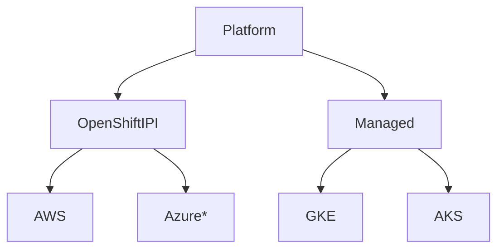

# scaffolding
Ansible Automation to bring up a Performance SUT

## Known Nuances
- GKE Cluster Destroy will destroy all clusters. We can switch to passing a kubeconfig and getting the cluster_name to destroy
- Stopping OpenShift mid-install can result in the `metadata.json` to be missing for a cleanup. To circumvent this, we can build a net-new `metadata.json` to clean up objects in the specified platform.

## Tools needed for execution
- kubectl
- gcloud
- curl
- git
- helm

## Structure
```
├── roles
│   ├── validate
│   │   └── tasks
│   │       └── main.yml
│   ├── platform
│   │   ├── vars
│   │   │   └── main.yml
│   │   ├── templates
│   │   │   ├── metadata.json
│   │   │   └── install-config.yaml
│   │   ├── tasks
│   │   │   ├── ocp.yml
│   │   │   ├── main.yml
│   │   │   └── gke.yml
│   │   └── files
│   │       └── install-config.yaml
│   ├── kernel
│   │   ├── tasks
│   │   │   └── main.yml
│   │   └── files
│   │       ├── ds-kernel.yaml
│   │       └── cm-kernel.yaml
│   └── cilium
│       └── tasks
│           ├── main.yml
│           └── gke.yml
├── group_vars
│   └── all
├── validate.yml
├── sa.json
├── README.md
├── platform.yml
├── ocp-run.out
├── kernel.yml
├── install-cilium.yml
└── hosts

```

## Role required vars and tags

- platform
  - extra-vars (OR)
    - create - Create the specific cluster
    - destroy - Destroy the specific cluster
  - tags
    - gke
    - ocp-aws
- validate (optional)
  - `cilium-cli connectivity test`
- kernel (optional)
  - tags
    - gke
- tools (optional)
- benchmarks (optional)

Each of the steps following the platform standup are optional, they can also be used with other platform standup tools, all we require is the `kubeconfig`

## Visual Overview

### Deploy Platform


## Setup
Ansible is a bit weird with `--tags` it asumes `all` if no tag is passed.

We will be using `--tags` for each cloud provider. Be sure to pass which provider you are interested in.

## Providers
- GKE (WIP)

### GKE
#### Setup
Login to the Console, choose the project you want to build clusters. Create a service account (under IAM), create a key (json), save it locally here as `sa.json`

#### Create cluster
`ansible-playbook platform.yml --tags gke -e "create=true" -e "num_nodes=2"`
This will create a 2 node cluster in GKE.

#### Cleanup
*Note* Currently, this will cleanup all clusters, use at your own risk.
`ansible-playbook platform.yml --tags gke -e "destroy=true"`
