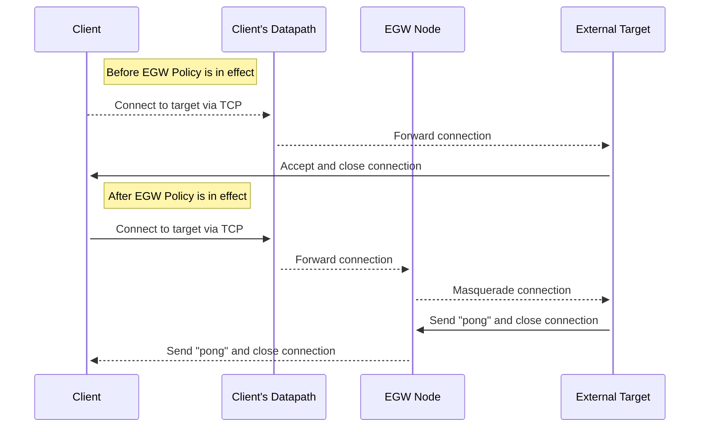

# egw-scale-utils

This project contains utilities for performing scale tests on Cilium's Egress
Gateway feature.

## Pod Masquerade Delay

This test measures the amount of time it takes for a Pod's network traffic to
be masqueraded through an EGW node to an external target.

### Test Overview

At a high-level, the test works by creating an EGW policy to target a workload
Pod that attempts to open a TCP connection to a pre-deployed external target.
If the pre-deployed external target sees that the source address of the TCP
connection is the pre-set EGW Node IP, then the external target will reply
with "pong" and close the connection. If the source address is not the pre-set
EGW Node IP, then the external target will close the connection without sending
any reply traffic.

When the client connects to the external target and does not receive any reply
traffic, the connection attempt is deemed a "miss". The client will continue
to connect to the external target until it receives "pong" in reply, allowing
for the implementation delay of an EGW policy for a new Pod to be measured.

A baseline test can be executed by running the test without deploying the
EGW Policy and by configuring the external target to always respond with
"pong" to any incoming requests.

### Component Details

This directory code to build and package a single binary that can act as
each of the components in the test. The binary has two subcommands:

1. `client`: Attempts to open a TCP connection to the given address until
   `pong` is sent back down the line or the test timeout is hit. An http
   server on port `2112` will respond to `GET` requests under the following
   paths:

   1. `/readyz`. After a connection is made to the target and `pong` is
      received or the test timeout is hit, `GET` requests will return code
      `200`. Beforehand, `GET` requests will return code `500`. This is used
      as a readiness probe to determine when the client has finished executing.
   2. `/metrics`. During the test, the client keeps track of test-relevant
      metrics which are exported as a Prometheus endpoint. See later sections
      for details on the metrics exported.

2. `external-target`: Continues to listen for new TCP connections on a pre-
   configured port. When a new connection is received that has a source address
   which is included in a pre-configured CIDR range, `pong` is send in reply and
   the connection is closed. If the source IP is not a part of the pre-configured
   CIDR range, then no reply traffic is sent and the connection is closed.

### Client Pod Metrics

|Name|Description|
|---|---|
|`egw_scale_test_leaked_requests_total`|The total number of leaked requests a client made when trying to access the external target.|
|`egw_scale_test_masquerade_delay_seconds_total`|The number of seconds between a client pod starting and hitting the external target.|
|`egw_scale_test_failed_tests_total`|Incremented when a client Pod is unable to connect to the external target after a preconfigured timeout.|
